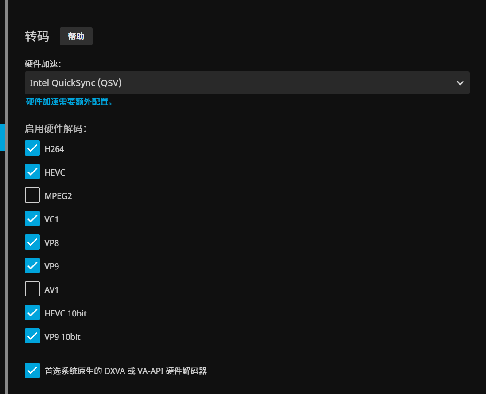
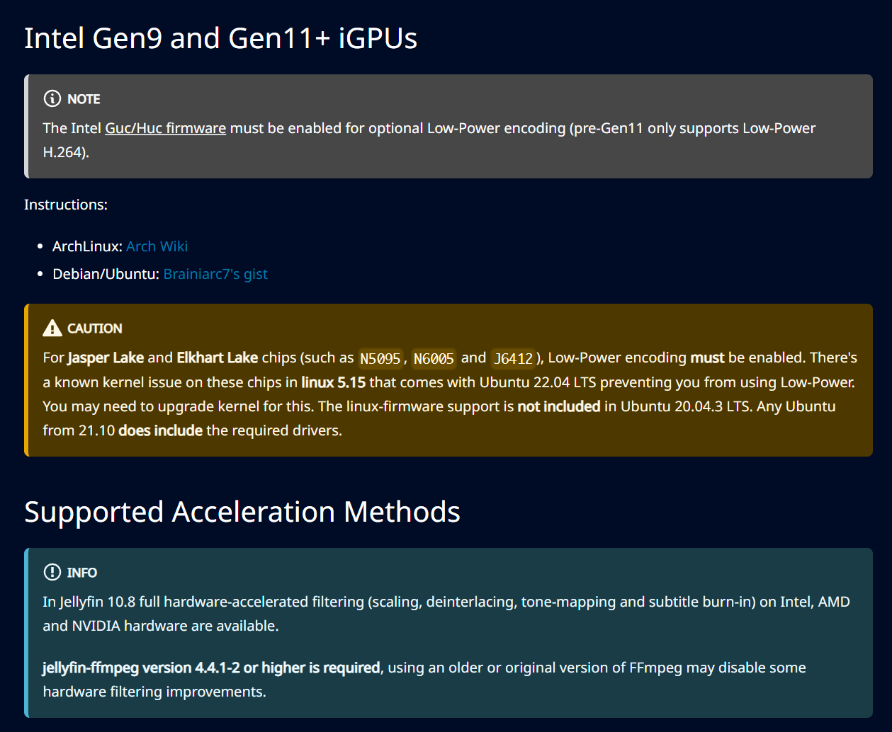
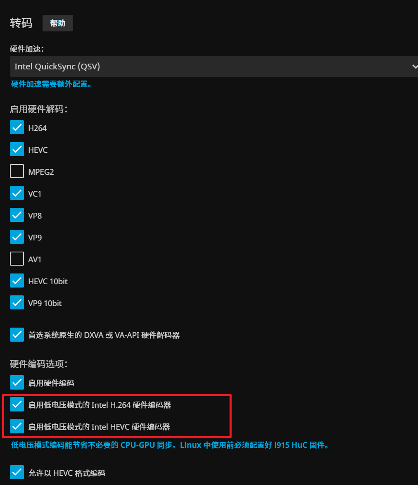

# intel 11代n5095安装jellyfin并使用硬解

## 前言
自己想组一个nas，一番权衡买了n5095的板子，想着这怎么说也能流畅硬解了吧（之前是j1900），然后安装jellyfin的艰难之路（各种坑）

## docker compose
```docker-compse
version: "3.5"
services:
  jellyfin:
    #   image: jellyfin/jellyfin:10.8.7
    image: nyanmisaka/jellyfin:221029-amd64
    container_name: jellyfin
    network_mode: "host"
    volumes:
      - /etc/timezone:/etc/timezone:ro
      - ./jellyfin/config:/config
      - ./jellyfin/cache:/cache
      - /mnt/3t:/mnt/3t
    devices:
      - /dev/dri/renderD128:/dev/dri/renderD128
      - /dev/dri/card0:/dev/dri/card0
    restart: "unless-stopped"
```
主要注意一点，就是镜像可以使用`nyanmisaka`这个大佬的镜像，基本东西都装全了，然后是`devices`需要映射显卡

## 打开硬解加速
正常来说，直接到jellyfin设置打开硬解加速即可

但是，因为是11代以上的酷睿，不能这样，这样直接是打不开的

根据`jellyfin`官方文档，<https://jellyfin.org/docs/general/administration/hardware-acceleration/#intel-gen9-and-gen11-igpus>
专门对这个问题做了探讨

结论就是11代以上必须要打开低功耗模式并且打开` Guc/Huc`这个（内核模块？）

这个模块默认是不打开的，需要你手动开启，开启方法是在
`/etc/modprobe.d/i915.conf`文件中写入`	options i915 enable_guc=2` linux内核大于4.10
小于则是`options i915 enable_guc_loading=1`
然后重启电脑

再检查低功耗模式是否打开


愉快观影吧！
